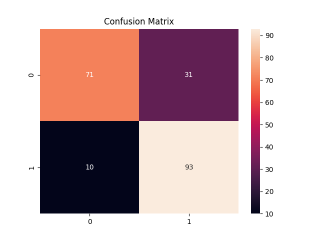

# Task 5: Decision Tree & Random Forest Classification

## Overview

This project demonstrates the implementation of **Decision Tree** and **Random Forest** models for a **Heart Disease Prediction** dataset. It focuses on understanding decision boundaries, controlling overfitting, evaluating model performance, and interpreting feature importance.

---

## Dataset Information

The dataset contains 13 clinical features used to predict the presence of heart disease:

| Feature  | Description                                                       |
| -------- | ----------------------------------------------------------------- |
| age      | Age of the patient                                                |
| sex      | Gender (1 = male, 0 = female)                                     |
| cp       | Chest pain type (0–3)                                             |
| trestbps | Resting blood pressure (mm Hg)                                    |
| chol     | Serum cholesterol (mg/dl)                                         |
| fbs      | Fasting blood sugar > 120 mg/dl (1 = true, 0 = false)             |
| restecg  | Resting electrocardiographic results (0–2)                        |
| thalach  | Maximum heart rate achieved                                       |
| exang    | Exercise induced angina (1 = yes, 0 = no)                         |
| oldpeak  | ST depression induced by exercise                                 |
| slope    | Slope of the peak exercise ST segment                             |
| ca       | Number of major vessels (0–3) colored by fluoroscopy              |
| thal     | Thalassemia (1 = normal, 2 = fixed defect, 3 = reversible defect) |
| target   | Diagnosis (1 = heart disease, 0 = no disease)                     |

---

## Folder Structure

```
Task5_TreesRF/
│
├── Data/
│   └── data.csv                    
│
├── notebooks/
│   └── Decision_Tree_RandomForest.ipynb     # Optional Jupyter notebook for exploration and testing
│
├── src/
│   ├── data_loader.py              
│   ├── model.py                    
│   ├── evaluate.py                
│   └── utils.py                   
│
├── outputs/
│   ├── decision_tree.png          
│   ├── rf_feature_importances.png 
│   ├── decision_tree_confusion_matrix.png
│   ├── random_forest_confusion_matrix.png
│   ├── decision_tree_roc.png
│   ├── random_forest_roc.png
│   └── reports.txt   # pkl files               
│
├── requirements.txt                
└── main.py                         
```

---

## Features

* Load and preprocess the Heart Disease dataset.
* Train a **Decision Tree** classifier and visualize its structure.
* Train a **Random Forest** model and interpret feature importances.
* Evaluate models using:

  * Confusion Matrix
  * Classification Report
  * ROC-AUC Curve
  * Cross-validation
* Visualize results and save outputs.

---

## Installation

1. **Clone the repository:**

```bash
git clone https://github.com/Mamoonkhan11/DT-RS___AI-ML
cd DT-RS___AI-ML
```

2. **Create and activate a virtual environment:**

```bash
python -m venv .venv
# Windows
.venv\Scripts\activate
# macOS/Linux
source .venv/bin/activate
```

3. **Install dependencies:**

```bash
pip install -r requirements.txt
```

---

## Usage

1. **Run the main script:**

```bash
python main.py
```

2. **Adjust parameters:**

* Modify `max_depth` in the Decision Tree to control overfitting.
* Change `n_estimators` in Random Forest for performance tuning.

3. **Output files:**
   Check the `outputs/` folder for:

* Decision tree diagram
* Confusion matrices
* ROC-AUC curves
* Feature importance chart

---

## Visualizations

**Decision Tree Visualization:**


**Random Forest Feature Importance:**


**Confusion Matrix (Decision Tree):**



**Confusion Matrix (Random Forest):**


**ROC Curves:**


---

## Dependencies

* Python >= 3.12
* pandas
* numpy
* scikit-learn
* matplotlib
* seaborn
* graphviz

*Install all using:*

```bash
pip install -r requirements.txt
```

---

## Key Concepts & Interview Notes

1. **Decision Tree:** Splits data based on information gain to classify outcomes.
2. **Entropy:** Measures data impurity (low entropy = pure nodes).
3. **Random Forest:** Combines multiple decision trees to reduce variance and improve accuracy.
4. **Overfitting:** When model fits training data too well — limit `max_depth` or increase data.
5. **Feature Importance:** Indicates how much each feature contributes to predictions.
6. **Cross-validation:** Validates model stability across multiple data folds.

---